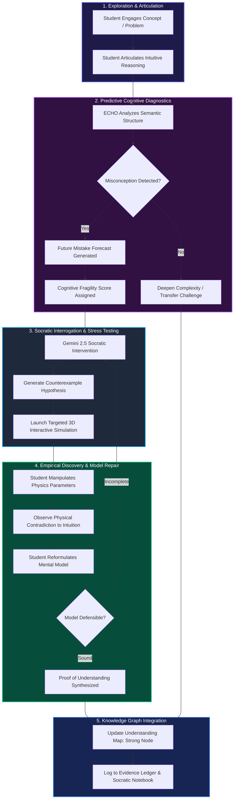
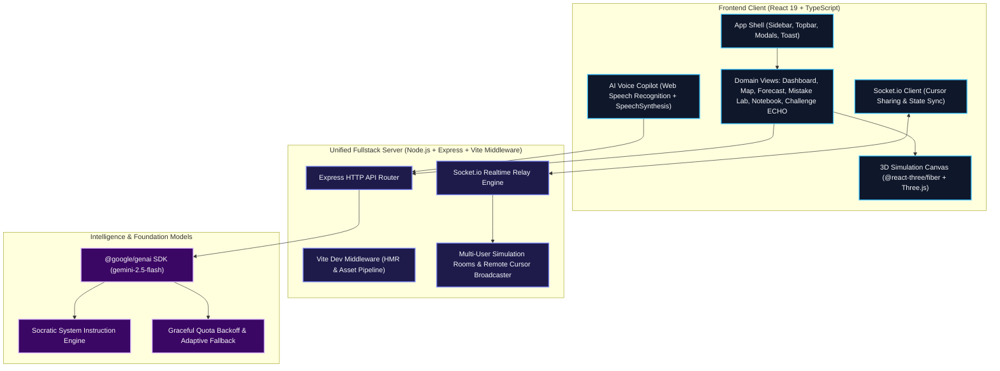

# 🔮 ECHO: AI Tutor
### *Evaluative Cognitive Heuristic Oracle — Predictive Socratic Learning Engine & Interactive 3D Cognitive Simulations*

<div align="center">

[](https://opensource.org/licenses/Apache-2.0)
[](https://react.dev/)
[](https://www.typescriptlang.org/)
[](https://ai.google.dev/)
[](https://threejs.org/)
[](https://socket.io/)
[](https://tailwindcss.com/)
[](https://vitejs.dev/)

**Stop Memorizing. Start Reasoning. Stress-Test Your Mental Models in Real-Time 3D.**

[Key Features](#-key-features) • [Architecture](#-system-architecture) • [Socratic Learning Loop](#-the-socratic-cognitive-learning-loop) • [3D Simulations](#-interactive-3d-simulation-suite) • [Getting Started](#-getting-started) • [API & WebSockets](#-api--websocket-protocol)

---

</div>

## 🌟 Overview & Philosophy

Most educational tools and AI chatbots act as **passive answer engines** — students paste in problems, receive instant solutions, and develop an **illusion of competence**. When presented with slight variations or counterintuitive physical edge-cases, their mental models crumble.

**ECHO (Evaluative Cognitive Heuristic Oracle)** transforms AI from a passive oracle into an **adversarial, Socratic intellectual sparring partner**. Powered by **Google Gemini 2.5 Flash** and backed by **interactive Three.js 3D physics simulators**, ECHO doesn't spoon-feed answers:
1. **Diagnoses Mental Models**: It listens to how you articulate concepts to detect hidden misconceptions.
2. **Forecasts Failures**: It predicts exactly which future problems you will fail based on conceptual fragility.
3. **Challenges with Counterexamples**: It constructs empirical, 3D simulations where your flawed logic breaks before your eyes.
4. **Validates Proof of Understanding**: You only advance when you can mathematically and intuitively defend your reasoning.

---

## 🔄 The Socratic Cognitive Learning Loop

ECHO implements a closed-loop cognitive refinement pipeline designed to turn fragile intuitions into rigorous conceptual mastery:



---

## 🏛️ System Architecture

ECHO combines modern client-side reactive rendering, real-time 3D WebGL computation, WebSocket synchronization, and Gemini AI streaming:



---

## 🎮 Interactive 3D Simulation Suite

ECHO includes **10 hardware-accelerated interactive simulations** built using **Three.js**, **React Three Fiber (`@react-three/fiber`)**, **Drei (`@react-three/drei`)**, and **Motion**:

| Simulation | Core Scientific Law | Controllable Parameters | Observable Phenomenon |
| :--- | :--- | :--- | :--- |
| **1. Shopping Cart Dynamics** | Newton's 2nd Law ($F_{net} = ma$) | Applied Force ($0-50\text{ N}$), Friction ($0-50\text{ N}$) | 3D block acceleration, velocity vectors, opposing force indicators |
| **2. Orbital Mechanics** | Kepler's Laws & Universal Gravitation ($F = G\frac{Mm}{r^2}$) | Central Star Mass ($10-100\text{ M}_\odot$) | Planetary orbital speed, glowing star deformation, orbital trail decay |
| **3. Chemical Kinetics** | Collision Theory & Arrhenius Equation ($k = Ae^{-E_a/RT}$) | Temperature ($10-100^\circ\text{C}$), Concentration ($10-100\%$) | 3D Beaker bubble frequency, energetic collision probability |
| **4. Circuit Flow Analysis** | Ohm's Law ($V = IR$) | Voltage ($1-24\text{ V}$), Resistance ($1-50\text{ }\Omega$) | Current calculation ($I$), 3D animated electron drift velocity |
| **5. Fluid Dynamics** | Bernoulli's Principle ($P + \frac{1}{2}\rho v^2 + \rho gh = \text{const}$) | Input Velocity ($5-50$), Pipe Constriction Gap ($10-40$) | Venturi effect, dynamic flowlines, velocity vs. pressure differential |
| **6. Quantum Superposition** | Quantum State Collapse & Bloch Sphere ($|\psi\rangle = \alpha|0\rangle + \beta|1\rangle$) | State Measurement Trigger, Rotation Speed | Multidimensional spinning qubit wavefunction collapsing into $|0\rangle$ or $|1\rangle$ |
| **7. Cellular Mitosis** | Cytokinesis & Biological Cell Division | Mitosis Stage Selector ($0-3$) | Prophase condensation, Metaphase plate alignment, Anaphase separation, Telophase |
| **8. Neural Network Training** | Gradient Descent & Backpropagation ($\theta \leftarrow \theta - \alpha\nabla L$) | Learning Rate $\alpha$ ($0.001-0.1$), Epoch counter | 3D layer perspective, connection weight intensity, real-time loss reduction |
| **9. Fourier Transform** | Harmonic Wave Superposition ($f(t) = \sum A_n \sin(2\pi f_n t)$) | Frequency 1 ($1-10\text{ Hz}$), Frequency 2 ($1-10\text{ Hz}$) | Real-time composite wave synthesis, harmonic decomposition waveforms |
| **10. Particle Collider** | Kinetic Gas Theory & Thermodynamic Bounded Collisions | Particle Count ($10-1000$), Kinetic Speed ($0.1-5\times$) | 3D instanced mesh collision dynamics, pressure volume kinetics |

---

## ⚡ Key Features

### 1. 🔬 Mistake Lab & Stress-Testing Sandbox
- Safe sandbox to intentionally break mental models.
- **Modifier Injections**:
  - `Air Resistance`: Introduces non-linear drag $F_d \propto v^2$.
  - `Variable Mass`: Simulates rocket equation dynamics ($m(t)$).
  - `Relativistic Physics`: Enforces light-speed asymptote ($v \to c$, Lorentz gamma $\gamma$).

### 2. 🎯 Future Mistake Forecast & Reasoning X-Ray
- Scans user problem-solving patterns to isolate fragile cognitive assumptions.
- Predicts errors before tests occur with estimated confidence and evidence tracing.
- Categorizes mastery levels into:
  - 🟢 **Strong**: Mathematically grounded, transferrable to novel problems.
  - 🟡 **Medium**: Operates well in standard scenarios, vulnerable to edge cases.
  - 🔴 **Fragile**: Formula memorized without mechanistic understanding.

### 3. 🗺️ Understanding Map
- Live visual knowledge topology mapping related STEM nodes.
- Highlights dependencies: e.g., mastering *Net Force* unlocks *Orbital Mechanics* and *Work-Energy Theorem*.

### 4. 🎙️ AI Copilot with Voice & Audio
- Hands-free voice interface using native **Web Speech API (`webkitSpeechRecognition`)**.
- Spoken audio feedback powered by the **SpeechSynthesis API**.
- Floating, collapsible glassmorphic copilot interface accessible on any screen.

### 5. 👥 Collaborative Multi-Learner Sync
- Built-in **Socket.io** real-time room communication.
- Live learner counter and remote cursor broadcasting.
- Synchronized physics parameter updates for peer study sessions.

### 6. 📓 Socratic Notebook & Evidence Ledger
- Auto-collates student breakthroughs, counterexamples discovered, and mathematical summaries.
- Tracks earned badges and proofs of understanding.

---

## 🛠️ Technology Stack

| Domain | Technology | Description |
| :--- | :--- | :--- |
| **Frontend Framework** | React 19 (`react`, `react-dom`) | Modern component architecture with concurrency |
| **Language** | TypeScript 5.8 | Strict type checking and structured models |
| **3D & Graphics** | Three.js + React Three Fiber + Drei | WebGL hardware-accelerated 3D simulations & shaders |
| **Styling** | Tailwind CSS 4 + Lucide Icons | Ultra-fast atomic CSS, responsive dark theme, modern iconography |
| **Motion** | Motion (`motion/react`) | Fluid physics-based UI transitions and animations |
| **AI / LLM** | Google Gemini 2.5 Flash (`@google/genai`) | High-speed, context-rich Socratic interrogation |
| **Backend** | Express 4 + Node.js 24 | REST API endpoints, static distribution |
| **Realtime WebSockets** | Socket.io 4.8 | Low-latency state sync, rooms, and cursor broadcasting |
| **Build & Bundler** | Vite 6 + tsx + esbuild | Instant HMR development and optimized production bundles |

---

## 📂 Project Directory Structure

```
echo/
├── public/                     # Static assets and icons
├── scripts/
│   └── legacy-patches/         # Archived migration & patch scripts
├── src/
│   ├── components/
│   │   ├── dashboard/          # Dashboard & simulation modules
│   │   │   ├── Counterexample.tsx
│   │   │   ├── Dashboard.tsx
│   │   │   ├── FutureMistakeForecast.tsx
│   │   │   ├── LearningLoop.tsx
│   │   │   ├── LiveSimulation.tsx       # 10 3D interactive simulations
│   │   │   ├── MistakeLab.tsx
│   │   │   ├── ProofOfUnderstanding.tsx
│   │   │   ├── ReasoningXRay.tsx
│   │   │   ├── TransferChallenge.tsx
│   │   │   ├── UnderstandingMap.tsx
│   │   │   └── YourUnderstanding.tsx
│   │   ├── ui-layer/           # Modals, settings, upgrade, and toasts
│   │   │   ├── Modals.tsx
│   │   │   └── Toast.tsx
│   │   ├── views/              # Dedicated full-screen domain views
│   │   │   ├── ChallengeEchoView.tsx    # Socratic Gemini chat interface
│   │   │   ├── EvidenceView.tsx
│   │   │   ├── ForecastView.tsx
│   │   │   ├── MistakeLabView.tsx
│   │   │   ├── NotebookView.tsx         # Interactive Socratic notebook
│   │   │   ├── ProgressView.tsx
│   │   │   ├── SimulationsView.tsx      # Multi-simulation browser
│   │   │   └── UnderstandingMapView.tsx
│   │   ├── AICopilot.tsx       # Speech-enabled floating AI copilot
│   │   ├── Layout.tsx          # Responsive layout shell
│   │   ├── PlaceholderView.tsx
│   │   ├── Sidebar.tsx         # Navigation drawer
│   │   └── Topbar.tsx          # Subject selector & user metrics
│   ├── context/
│   │   └── UIContext.tsx       # Toast, modal, and app state provider
│   ├── lib/
│   │   └── utils.ts            # Class merging utility (clsx + twMerge)
│   ├── App.tsx                 # Root application router
│   ├── index.css               # Design tokens & styles
│   ├── main.tsx                # React DOM root entry
│   └── types.ts                # TypeScript domain models
├── .env.example                # Sample environment variables
├── .gitignore                  # Git ignore rules
├── index.html                  # HTML5 entry with metadata
├── metadata.json               # Application capability metadata
├── package.json                # Project dependencies and npm scripts
├── server.ts                   # Express + Socket.io + Gemini API server
├── tsconfig.json               # TypeScript compiler configuration
└── vite.config.ts              # Vite + Tailwind CSS plugin config
```

---

## 🚀 Getting Started

### Prerequisites
- **Node.js**: Version `20.x` or higher (tested on Node `v24.19.0`)
- **npm**: Version `10.x` or higher (or `bun` / `pnpm`)
- **Google Gemini API Key**: Obtain a free API key from [Google AI Studio](https://aistudio.google.com/)

### 1. Clone the Repository
```bash
git clone https://github.com/Anurag-tech22/Echo-AI-Tutor.git
cd Echo-AI-Tutor
```

### 2. Install Dependencies
```bash
npm install
```

### 3. Configure Environment Variables
Copy `.env.example` to create a `.env` file:
```bash
cp .env.example .env
```

Open `.env` and add your Gemini API Key:
```env
GEMINI_API_KEY="your_actual_gemini_api_key_here"
PORT=3000
NODE_ENV="development"
```

> **Note**: If no API key is supplied, ECHO runs in **Simulated Fallback Mode**, providing pre-configured Socratic responses so you can still explore the full UI and all 3D simulations.

### 4. Run Development Server
```bash
npm run dev
```

Open your browser and navigate to:
```
http://localhost:3000
```

### 5. Build for Production
To generate an optimized bundle and run the compiled server:
```bash
npm run build
npm start
```

---

## 📡 API & WebSocket Protocol

### Socratic Chat API (`POST /api/chat`)
Sends conversation history to the Gemini 2.5 Flash Socratic engine.

- **URL**: `/api/chat`
- **Method**: `POST`
- **Headers**: `Content-Type: application/json`
- **Request Body**:
  ```json
  {
    "messages": [
      {
        "role": "user",
        "content": "A heavier object falls faster because gravity pulls harder on it."
      }
    ]
  }
  ```
- **Response**:
  ```json
  {
    "text": "Your intuition about force is correct: heavier objects experience greater gravitational force (F = mg). But consider: what property of mass resists acceleration (F = ma)? What happens when you equate the two?"
  }
  ```

### Socket.io Real-Time Events
| Event | Direction | Payload | Description |
| :--- | :--- | :--- | :--- |
| `join_sim` | Client $\to$ Server | `room: string` | Joins a collaborative simulation room |
| `user_count` | Server $\to$ Client | `count: number` | Emits the number of connected learners in room |
| `sim_param_change` | Client $\to$ Server | `{ room: string, params: object }` | Transmits updated simulation controls (force, mass, etc.) |
| `sim_param_update` | Server $\to$ Client | `params: object` | Broadcasts parameter changes to other peers |
| `cursor_move` | Client $\to$ Server | `{ room: string, cursor: { x, y } }` | Transmits mouse pointer coordinate |
| `remote_cursor` | Server $\to$ Client | `{ id: string, cursor: { x, y } }` | Displays peer cursor position in real-time |

---

## 🛡️ License

This project is licensed under the **Apache-2.0 License** — see the [LICENSE](LICENSE) file for details.

---

<div align="center">

**Built with ❤️ for curious minds by [Anurag-tech22](https://github.com/Anurag-tech22)**

*Empowering learners through active reasoning, Socratic inquiry, and interactive 3D physics.*

</div>
