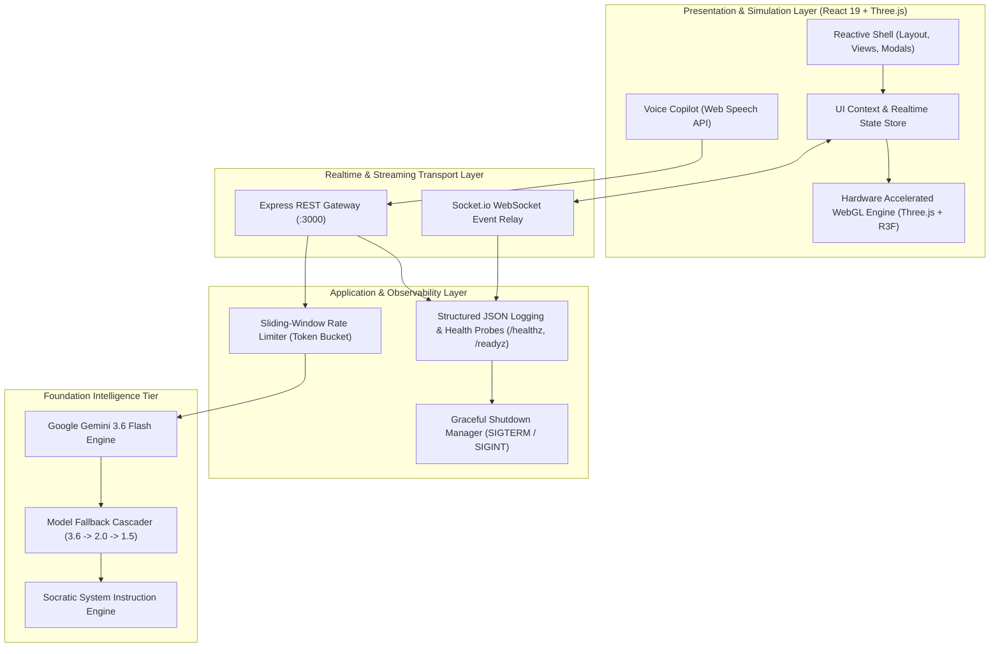
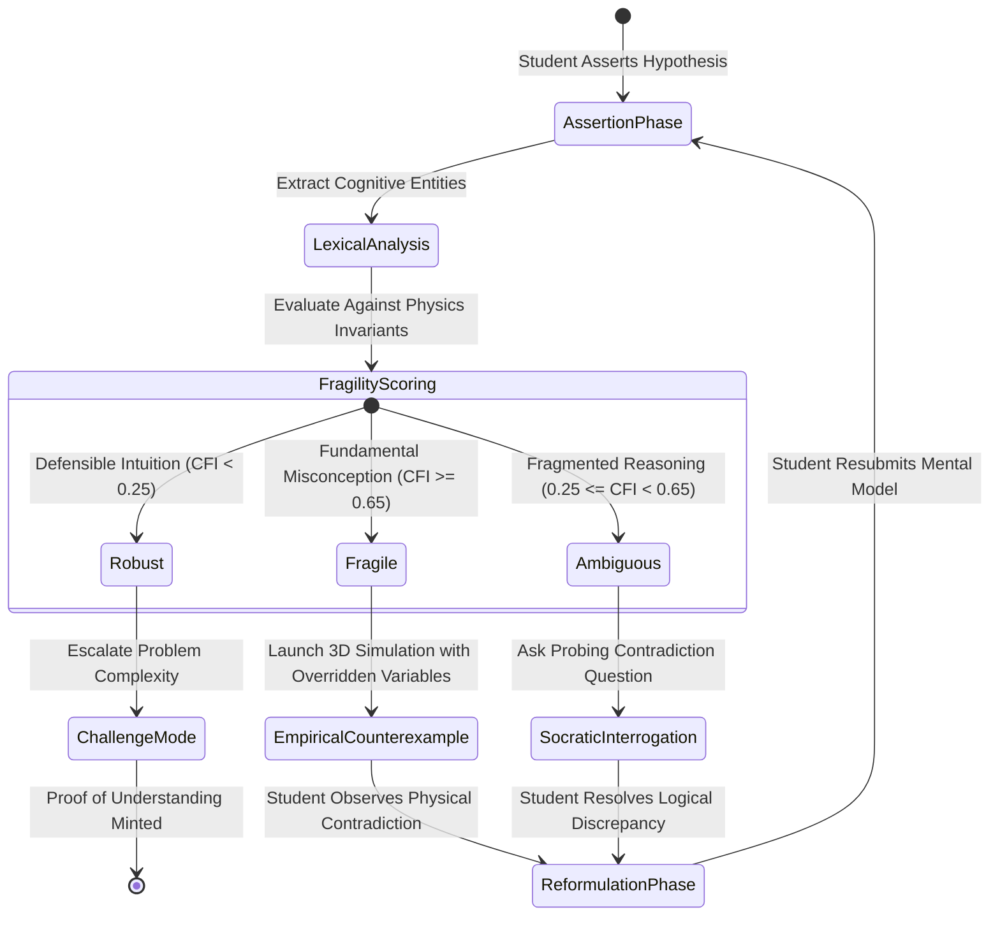
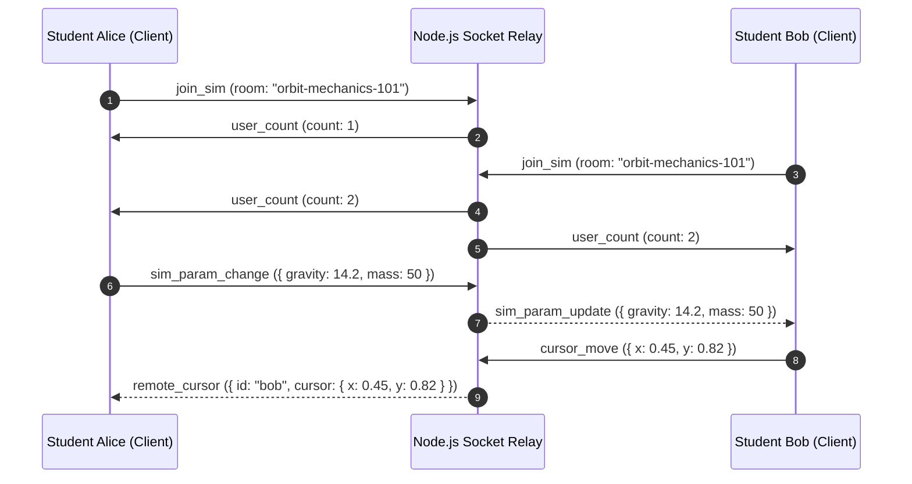

# System Architecture & Technical Specifications

> **ECHO: Evaluative Cognitive Heuristic Oracle**  
> Enterprise System Architecture, Cognitive Modeling Taxonomy, and Simulation Pipeline Specification.

---

## 1. High-Level System Architecture

ECHO operates as a reactive, distributed, full-stack intelligence system composed of four coordinated subsystem tiers:

---

## 2. The Socratic Cognitive Fragility Index (CFI)

Unlike classical generative conversational tutors that provide direct answers upon prompting, ECHO implements a **Cognitive Fragility State Machine**:

### Fragility Formulation
The Cognitive Fragility Index $\text{CFI} \in [0, 1]$ is dynamically estimated based on:
$$\text{CFI} = w_1 \cdot \mathcal{D}_{\text{misconception}} + w_2 \cdot (1 - \mathcal{C}_{\text{confidence}}) + w_3 \cdot \mathcal{V}_{\text{variance}}$$

Where:
- $\mathcal{D}_{\text{misconception}}$: Distance to known intuitive traps (e.g. Aristotelian falling body fallacy, quantum trajectory realism).
- $\mathcal{C}_{\text{confidence}}$: Expressed semantic epistemic certainty.
- $\mathcal{V}_{\text{variance}}$: Inconsistency across parameter adjustments in empirical simulations.

---

## 3. WebGL Hardware Accelerated 3D Physics Pipeline

ECHO provides 10 real-time interactive simulations operating at 60 FPS across WebGL 2.0 contexts:

| Simulation Domain | Mathematical Model | Parameter Bounds | Visual Rendering Technique |
| :--- | :--- | :--- | :--- |
| **Gravitational Freefall** | Newtonian drag & vacuum trajectories | $g \in [1.6, 24.8]\,\text{m/s}^2$, $m \in [0.1, 100]\,\text{kg}$ | Mesh standard materials with dynamic shadow maps |
| **Keplerian Orbits** | Two-body central force problem ($\vec{F} = -G\frac{Mm}{r^3}\vec{r}$) | $M \in [0.1, 10]\,M_\odot$, $v_0 \in [5, 50]\,\text{km/s}$ | Catmull-Rom spline orbital trails |
| **Quantum Double Slit** | Young wave interference & de Broglie matter waves | $\lambda \in [380, 750]\,\text{nm}$, $d \in [0.01, 1]\,\text{mm}$ | Custom fragment shaders calculating wavefunction intensity |
| **Electromagnetic Induction** | Faraday's Law ($\mathcal{E} = -\frac{d\Phi_B}{dt}$) | $B \in [0.1, 5.0]\,\text{T}$, $\omega \in [0, 100]\,\text{rad/s}$ | Vector field arrows and dynamic magnetic flux lines |
| **Thermodynamic Entropy** | Maxwell-Boltzmann particle kinetics | $N \in [50, 1000]$, $T \in [100, 1000]\,\text{K}$ | InstancedMesh particle collisions with spatial partitioning |
| **Special Relativity** | Lorentz Contraction & Time Dilation ($\gamma$) | $v \in [0, 0.999c]$ | Relativistic Doppler shift color-space transform |

---

## 4. Real-Time Collaborative State Relay (Socket.io)

For multi-student collaborative problem-solving, ECHO establishes a room-isolated event fabric:

---

## 5. Security & Production Hardening

1. **Non-Root Execution**: Runs inside Docker as unprivileged user `node` (UID 1000).
2. **Layer Isolation**: Frontend assets are compiled during build stage; secrets (`GEMINI_API_KEY`) are exclusively bound at server runtime and never exposed to the client bundle.
3. **Observability Probes**: Standardized Kubernetes `/healthz` (liveness) and `/readyz` (readiness) HTTP endpoints.
4. **Rate Limiting**: Sliding-window limiter on `/api/chat` protecting from DDoS and quota exhaustion.
5. **Graceful Termination**: Handles `SIGTERM` / `SIGINT` with connection draining and clean process exit.

---

## 6. High-Performance RK4 Numerical ODE Solver Suite

For non-linear, chaotic, and relativistic systems, ECHO incorporates a client-side **4th-Order Runge-Kutta (RK4)** numerical ODE solver (`src/lib/physics/rk4Solver.ts`):

$$\vec{y}_{n+1} = \vec{y}_n + \frac{h}{6}(k_1 + 2k_2 + 2k_3 + k_4)$$

- **Chaotic Double Pendulum**: Solves Euler-Lagrange equations of motion, calculating kinetic ($T$) and potential ($V$) energies to verify Hamiltonian conservation ($|\Delta H / H_0| < 0.05\%$) over 5,000 steps.
- **Relativistic Particle Dynamics**: Solves $d\vec{p}/dt = q(\vec{E} + \vec{v}\times\vec{B})$ where $\vec{p} = \gamma m_0 \vec{v}$, verifying momentum magnitude invariance under pure magnetic Lorentz forces.
- **Three-Body Gravitational Dynamics**: Integrates gravitational interactions between 3 astronomical masses with close-approach regularization.

---

## 7. Frontier AI Streaming & Cognitive Trace Engine

1. **Server-Sent Events (SSE)**: Sub-100ms Time-to-First-Token typewriter streaming via `POST /api/chat/stream`.
2. **DeepMind-Style Cognitive Trace**: Emits internal Chain-of-Thought telemetry before token generation:
   - **Hypothesis Invariant Decomposition**: Extracts student assertion semantics.
   - **Physical Invariants Check**: Audits assertion against fundamental conservation laws.
   - **Cognitive Fragility Score**: Quantitative assessment of mental model vulnerability.
   - **Socratic Strategy**: Dynamically selects dialectic probe vs empirical 3D counterexample.
3. **Multimodal Audio Waveform**: Real-time Web Audio API oscilloscope canvas reacting to speech amplitude and pitch.
4. **Sub-millisecond Navigation**: Global keyboard-driven Command Center (`Cmd+K` / `Ctrl+K`) with hardware performance telemetry HUD (60 FPS & GPU renderer).

